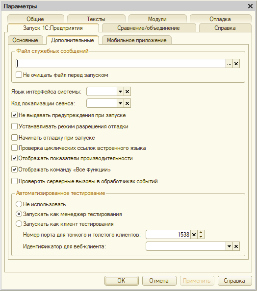
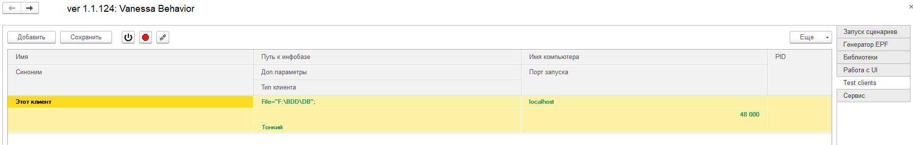
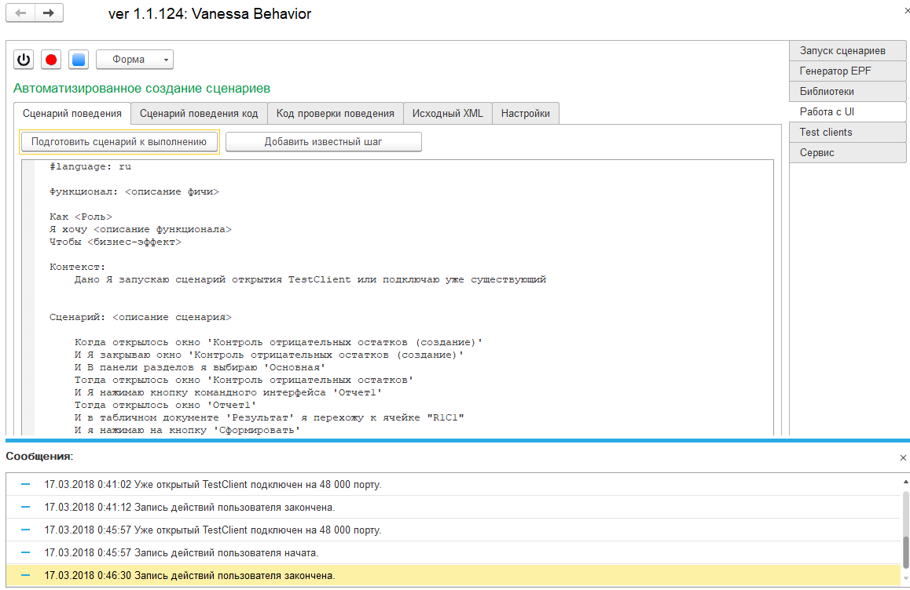
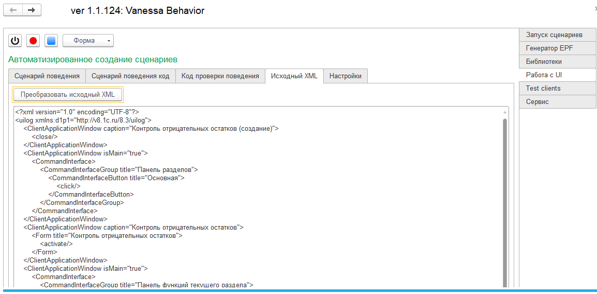
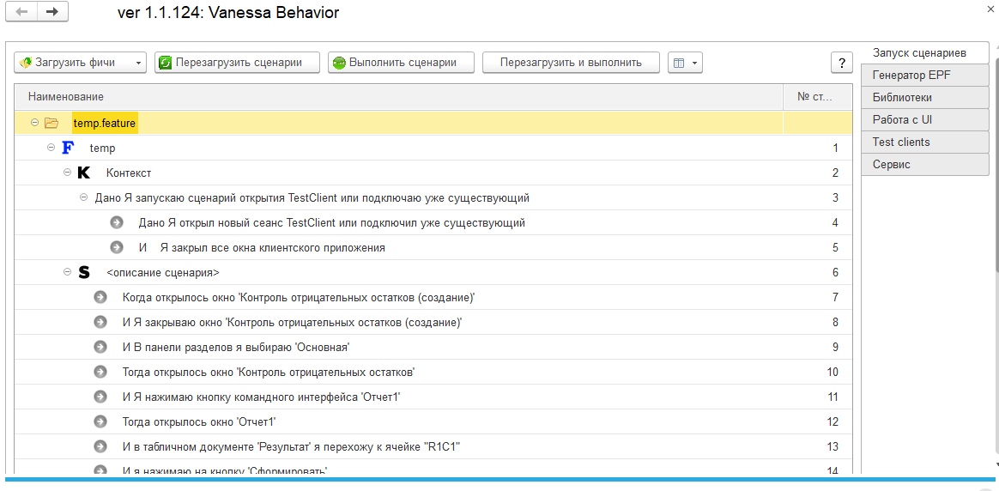

# Практическая работа с vanessa-behavior

Воспользоваться параметром DisableUnsafeActionProtection файла conf.cfg . В этом случае механизм защиты от опасных действий будет отключаться для всех пользователей информационных баз, строки соединения которых удовлетворяют указанным маскам.

В *C:\Program Files (x86)\1cv8\conf\conf.cfg*  Добавить параметр: DisableUnsafeActionProtection=.* 

1.  Включить менеджер тестирования – например через настройку в конфигураторе:

Сервис-\>Параметры-\>Запуск 1С-\>Дополнительные-\>**Запускать как менеджер тестирования**.



Другой способ запустить менеджера тестирования - из командной строки с ключом `/TESTMANAGER`. Например:
```
"C:\Program Files (x86)\1cv8\8.3.2.163\bin\1cv8.exe" ENTERPRISE /F C:\Users\username\Documents\InfoBase /TESTMANAGER
```
[Пример на 1с ИТС](https://its.1c.ru/db/metod8dev/content/5011/hdoc)
2.  3апустим менеджер тестирования и откроем в нем behavior. Например 'E:\git-s\Buh_2_ua\tools\vanessa-behavior\vanessa-behavior.epf'



3.  Перейдем на закладку Test clients-\>Подключить…-\>Начать запись…

4.  ИЛИ Перейдем на закладку “Работа с UI” и нажмем кнопку “Начать запись поведения”.

5.  После нажатия на кнопку “**Начать запись**” должен открыться клиент тестирования.

6.  Он открылся, но программно была запущена запись действий пользователя, о чем подсказывает сообщение.

7.  Итак, переходим в клиент тестирования и что-нибудь поделаем.

8.  По окончании вернемся в менеджер тестирования и **завершим запись** действий пользователя.

9.  В окне Сценарий поведения Появился текст фичи и в нем есть шаги.



10. Исходный XML можно просматривать в одноименном окне

Нажав на Преобразовать Исходный XML – мы так-же получаем текст фичи и в нем есть шаги …

для каждого из этих шагов уже созданы и запрограммированы процедуры проверки шагов, они находятся в библиотеке (путь к ней заполняется автоматически при открытии инструмента).

11. В окне Сценарий поведения Нажав на **Подготовить Сценарий к выполнению-**переключаемся в окно Запуск сценариев



12. Сохраним текст фичи.

13. Откроем новую фичу в behavior.

14. Разместим рядом менеджер и клиент тестирования и запустим выполнение сценария.

15. Как вы видите, действия пользователя успешно воспроизведены и мы при этом не написали ни строчки кода, собственно от сюда и название функционала “фичи из “воздуха”.
